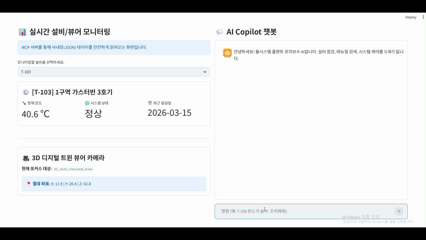
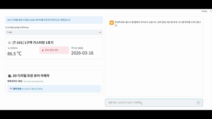
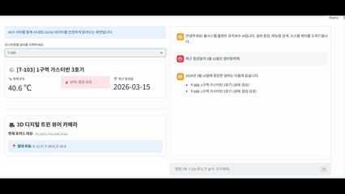
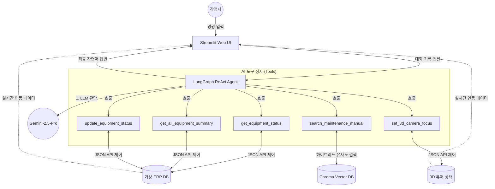

# 🏭 율시스템 I3D 플랜트 유지보수 AI Copilot 

 


복잡한 산업용 플랜트 현장에서 발생하는 수많은 설비 경고와 유지보수 메뉴얼을, AI(LLM)가 스스로 확인하고 진단하여 조치까지 취해주는 **설비 유지보수 자율 Agent (Copilot)** 데모 프로젝트입니다.

사내망(온프라미스/로컬) ERP 데이터베이스와 3D 디지털 트윈 뷰어 장비를 통합 제어하는 **MCP(Model Context Protocol)** 철학을 흉내 내어, 언어 모델이 로컬 시스템의 데이터 상태를 직접 조회하고 조작할 수 있도록 구현되었습니다.

---

## 🎯 주요 기능 (Key Features)

1. **대화형 LLM 에이전트 (ReAct 기반)**
   - 작업자가 "1구역에 온도 높은 장비 찾아봐"라고 자연어로 명령하면, 스스로 '생각(Thought) -> 도구 선택(Action) -> 결과 관찰(Observation)' 사이클을 돌아 정답을 도출합니다.
2. **사내 데이터 자율 연동 (Tool Usage)**
   - API 통신과 JSON 파일 제어를 통해 가상의 **로컬 ERP 시스템**과 **3D 뷰어 카메라 좌표 시스템**을 안전하게 조회하고 변경합니다.
3. **지식 검색 엔진 (Hybrid RAG 검색 구현)**
   - 수십 페이지의 설비 매뉴얼 텍스트 파일(`turbine_manual.txt`) 속에서 필요한 대응법만 쏙쏙 뽑아냅니다.
   - 벡터 임베딩(Vector Similarity) 검색의 한계인 '식별 번호 혼동'을 해결하기 위해, 정규표현식(`Regex`)을 결합한 **하이브리드 재정렬(Re-ranking)** 로직이 이중으로 탑재되어 100%의 정확성(T-101 등 고유명사 감지)을 보장합니다.
4. **프리미엄 대시보드 UI (Streamlit)**
   - 스트림릿(Streamlit)을 기반으로, 실제 관제 화면(Dashboard)처럼 작동하는 모니터링 뷰와 AI 챗봇 뷰를 1:1 분리하여 카드형(UI Card) 및 다크 모드로 구축했습니다.
   - LLM이 시스템 데이터를 변경(제어)하면 웹 UI가 **실시간으로 연동되어 리로딩(Rerun)** 됩니다!

---

## 📸 시연 시나리오 (Demo Scenarios)

| 시나리오 01. 매뉴얼 지식 검색 | 시나리오 02. 시스템 통합 제어 | 시나리오 03. 안전한 예외 처리 |
| :---: | :---: | :---: |
|  |  |  |
| **V-103 매뉴얼 정보 제공** | **시스템 이상 및 자동 조치** | **데이터 부재 및 예외 대응** |
| RAG 파이프라인을 통해 방대한 매뉴얼에서 V-103 설비의 상세 조치법을 정확히 찾아냅니다. | 온도 이상 발생 시, AI가 매뉴얼을 검색하고 ERP 상태 갱신 및 3D 뷰어를 자동으로 연동합니다. | 최근 점검 날짜를 확인했으나 시스템에 해당 기록이 없을 때, 환각 없이 정보가 없음을 명확히 안내합니다. |

---

## 🛠️ 기술 스택 (Tech Stack)


### **Core AI Engine**
* **LLM:** Google `Gemini 2.5 Pro` (via `langchain-google-genai`)
* **Agent Framework:** `LangGraph` (`create_react_agent`)
* **Memory Management:** `SystemMessage`, `HumanMessage` 기반 전체 대화 컨텍스트 유지 기능

### **RAG (지식 검색 파이프라인)**
* **Vector DB:** `ChromaDB` (로컬 기반 DB 파일 구축)
* **Embedding Model:** HuggingFace `jhgan/ko-sroberta-multitask` (가볍고 빠른 한국어 최적화 모델)
* **Text Splitter:** `CharacterTextSplitter` (300토큰 사이즈, 50 오버랩 청킹)

### **Frontend & Data**
* **Web UI:** `Streamlit` (커스텀 CSS, Metric 컴포넌트 활용 다이나믹 뷰어)
* **Mock DB System:** `.json` 베이스의 로컬 파일 입출력으로 사내 시스템 모사 (`app.py`, `agent.py`)

---

## ⚙️ 시스템 아키텍처 워크플로우 (Workflow)



---

## 🚀 설치 및 실행 방법 (Quick Start)

본 프로젝트는 윈도우(Windows) 가상환경(`venv`) 기반으로 구축되었습니다.

### 1단계: 프로젝트 환경 구축
```cmd
# 저장소 및 프로젝트 폴더 이동
cd C:\YoulSystem

# Python 가상환경(venv) 생성 및 활성화
python -m venv venv
venv\Scripts\activate

# 필수 패키지 설치
pip install langchain langchain_google_genai langgraph
pip install streamlit python-dotenv
pip install langchain-community sentence-transformers chromadb 
```

### 2단계: API 보안 키 설정
루트 디렉토리(`C:\YoulSystem\`) 최상단에 `.env` 파일을 생성하고 발급받은 Gemini API 키를 기입하세요.
```env
# .env 파일 생성 후 기재
GOOGLE_API_KEY=당신의_제미나이_API_키_입력
```

### 3단계: RAG 지식 데이터베이스 구축 (최초 1회 필수)
터미널에서 아래 명령을 통해 `turbine_manual.txt` 매뉴얼을 잘게 쪼개어 로컬 Chroma DB(`data/chroma_db/`)를 생성합니다.
*(주의! DB가 생성되어야 AI가 지식 검색을 시작할 수 있습니다.)*
```cmd
python rag_pipeline.py
```

### 4단계: Streamlit 서버 구동 (실행)
모든 준비가 완료되었다면 에이전트를 스트림릿 웹 화면으로 띄웁니다!
```cmd
streamlit run app.py
```
> 브라우저가 열리면 우측 챗봇 창에서 **"오늘 점검해야 할 설비를 알려줘"** 또는 **"T-101의 온도가 80도인데 조치해줘"** 라고 대화를 시작하시면 됩니다!

---

## 💡 엔터프라이즈 레벨 트러블슈팅 (Troubleshooting)
본 프로젝트는 단순 튜토리얼 봇 작성을 넘어, 실제 LLM을 산업에 도입했을 때 터지는 **'환각, DB 충돌, 키워드 검색 맹점'** 등을 직접 겪으며 코드를 디버깅하고 고도화한 "실무 지향적 코딩 방식"으로 제작되었습니다. 

상세한 버그 분석 및 해결 아키텍처는 아래 문서를 참고해주세요.
- [01. 인공지능 컨텍스트 기억 상실 에러](오류사항들/01.이전대화기억오류.md)
- [02. 명시적 가드레일 부재로 인한 환각 현상 분석](오류사항들/02.환각현상.md)
- [03. Dense Retrieval 망각 현상(DB 중첩 문제)](오류사항들/03.이전DB덮어쓰기.md)
- [04. 1차망(Vector) 한계 극복을 위한 2차 정규식(Regex) 하이브리드 리랭킹 도입](오류사항들/04.검색키워드매칭.md)

---
> **Developer:** [사용자 이름]
> **Tech Support AI:** 율시스템 전속 AI 엔지니어링 에이전트 ('Antigravity')
